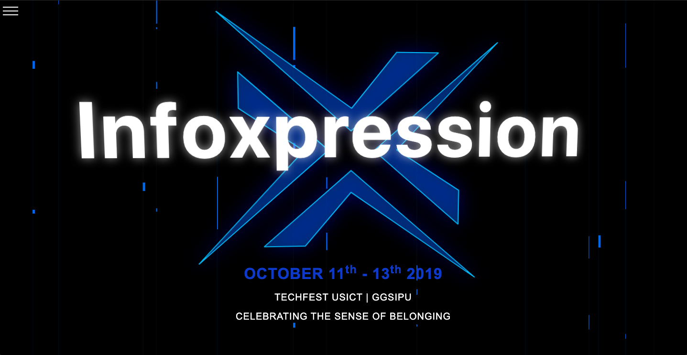
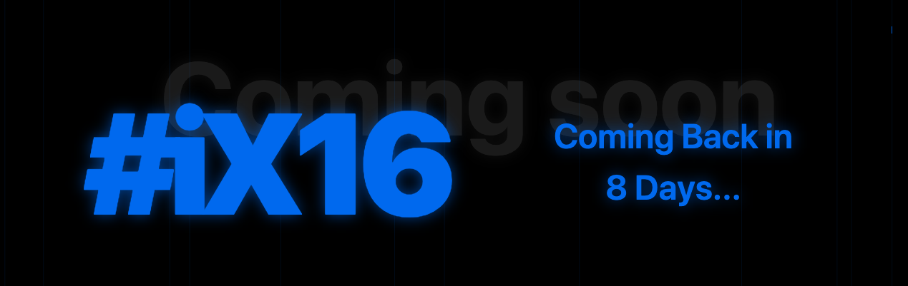
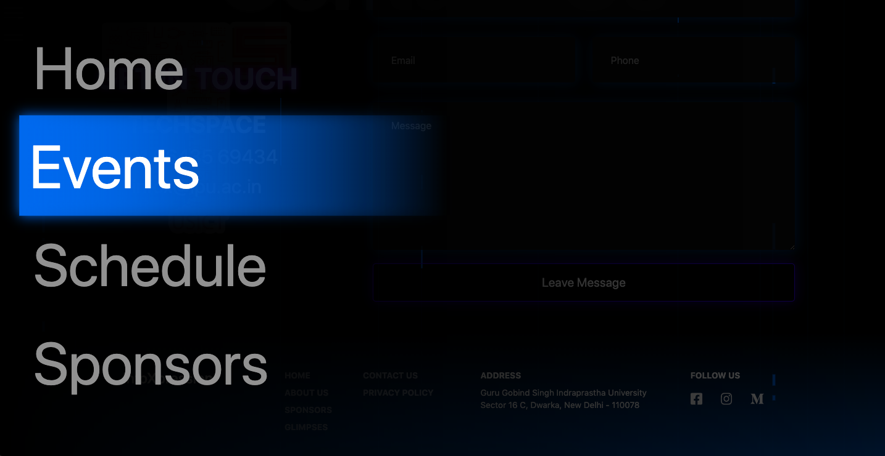
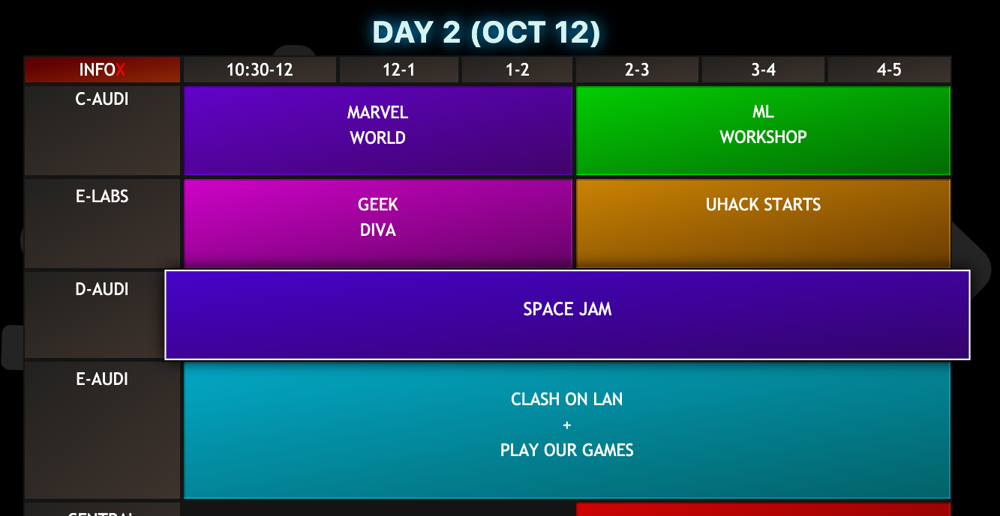
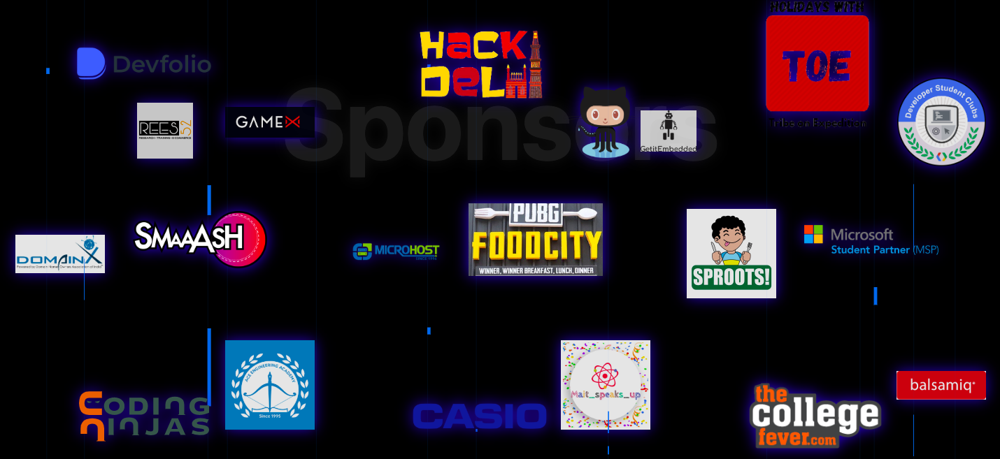

# INFOX 2019

### The official repository for InfoXpression 2019

## Setup -

> This project is made using **Vue.js**. So make sure you have **Node** installed before deploying it locally.

```
cd frontend
npm install
npm run serve
```

## Tools and Technologies used:-

- [**Vue.js**](https://vuejs.org) for dividing the project into components for a larger team to contribute without git restrictions.
- [**AOS**](https://michalsnik.github.io/aos) for the scrolling fade animations.
- [**Rellax.js**](https://dixonandmoe.com/rellax/) for the content Parrallax.
- [**Card Design**](https://github.com/dhruvmisra/card-design-prototype) for the event card animation.

## Glimpses

### Hero Section



### Heading Effects



### Navigation



### Schedule



### Sponsors Display



## Deploy Instructions.

```
cd frontend
npm install
npm run build
```

> This will create a dist folder with bundled js ,css and html files in it. Just serve these files over any server and the site would work.
